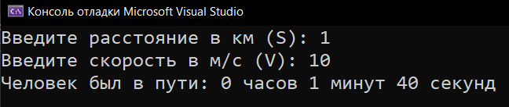
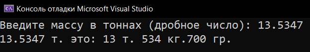
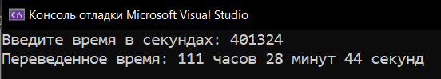
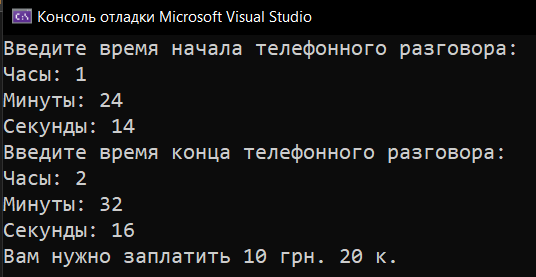

# Homework_3_Variables
Д/з: Variables

<a href="https://gist.github.com/SlavikArt/0296289188a0eb5e979ef677b9c8f5c7">Gist - страница со всеми кодами проектов</a>

* [Distance_Speed_Time](Distance_Speed_Time)
* [Tons_To_String](Tons_To_String)
* [Seconds_To_String](Seconds_To_String)
* [How_Much_Is_The_Call_Time](How_Much_Is_The_Call_Time)

  <h2>Distance speed time</h2>
  
Определить время.

  
  <h2>Tons to string</h2>
  
Тонны в т. кг. г.

  
  <h2>Seconds to string</h2>
  
Секунды в ч. мин. с.

  
  <h2>How much is the call time</h2>
  
Сколько стоит разговор.

  

